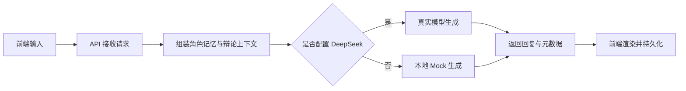

# echoes

> 面向历史人物拟人化对话与辩论的全栈原型。

一套面向“历史人物对话 + 辩论”的 AI 原型工程。它不是一个单纯的聊天壳，而是一条从前端交互、后端上下文组装、人物记忆管理，到模型生成与本地持久化的完整链路。

它为每个历史人物提供一套可追溯的“人格约束”，再配上一条能持续积累的对话记忆和辩论上下文，让 AI 尽量说得像那个人，而不是像一个泛化助手。

> 目标很直接：让历史人物“像自己”，而不是“像 AI 在扮演历史人物”。

```text
人格约束 + 角色记忆 + 辩论上下文 + 模型生成 + 本地持久化
```

## 项目亮点

| 维度 | 说明 | 价值 |
| :-- | :-- | :-- |
| 对话 | 单人物问答 + 本地历史 | 可持续追溯 |
| 辩论 | 多角色轮流发言 + 立场约束 | 更像真实讨论 |
| 记忆 | 按用户与人物拆分存储 | 避免上下文漂移 |
| 模型 | DeepSeek 优先，本地 Mock 回退 | 便于联调与离线开发 |
| 部署 | pnpm + Vite + Express + pm2 + nginx | 从开发到上线能落地 |

## 这套系统在做什么

- 历史人物对话：围绕单一人物展开问答，支持本地历史记录。
- 人物辩论：支持最多 3 位角色围绕同一辩题连续发言，并保存辩论记录。
- 角色宪法：用规则约束每位人物的知识边界、语言风格与反应方式。
- 记忆管理：按用户和人物维度保存对话，辅助模型保持上下文一致性。
- 模型接入：优先使用 DeepSeek，未配置时回退到本地模拟器，便于离线开发。

## 技术栈

- 前端：React 18 + TypeScript + Vite
- 后端：Node.js + Express + TypeScript
- 模型接入：DeepSeek Chat API（可选）
- 本地回退：LLM Mock 模拟器
- 数据存储：本地 JSON 文件持久化
- 工程管理：pnpm workspaces
- 部署：pm2 + nginx + 静态站点发布脚本

## 项目结构

```text
.
├── apps/
│   ├── api/        # Express API、记忆管理、模型调用
│   └── web/        # React 前端
├── scripts/
│   └── deploy.sh   # 一键部署脚本
├── .env.example
├── package.json
├── pnpm-workspace.yaml
└── README.md
```

## 运行流程

1. 前端页面收集用户输入，或者在辩论模式下收集辩题与参与者。
2. 前端把问题、人物、辩题和辩论上下文发给 API。
3. 后端根据人物宪法、最近对话、辩论前文和检索结果拼装提示词。
4. 若配置了 `DEEPSEEK_API_KEY`，后端调用 DeepSeek；否则使用本地模拟器。
5. 返回结果后，前端渲染回复，并把历史写入本地存储。
6. 辩论模式会额外保存辩论记录，便于后续回看和导出。



## 环境要求

- Node.js 18 或更高版本
- pnpm 9 或更高版本
- Windows、macOS、Linux 均可开发；部署脚本以 Linux 服务器为主

建议先检查版本：

```bash
node -v
pnpm -v
```

## 安装依赖

在仓库根目录执行：

```bash
pnpm install
```

如果你的环境对 lockfile 比较严格，而安装被阻止，可以改用：

```bash
pnpm install --no-frozen-lockfile
```

## 配置环境

仓库根目录提供了 `.env.example`，你可以据此创建环境文件。最常用的是后端 API 环境：

```bash
cp .env.example apps/api/.env
```

或者直接在 `apps/api/.env` 中配置以下变量：

```dotenv
PORT=4000
DEEPSEEK_API_KEY=
DEEPSEEK_API_URL=https://api.deepseek.com/v1
ECHOES_DB_PATH=./echoes.db.json
ECHOES_DB_MAX_ENTRIES=1000
```

前端如果需要显式指定 API 地址，可以设置：

```dotenv
VITE_API_BASE=http://localhost:4000
```

说明：

- `DEEPSEEK_API_KEY`：配置后启用真实模型调用；不配置则使用本地模拟器。
- `DEEPSEEK_API_URL`：可选，自定义 DeepSeek 网关地址。
- `PORT`：API 服务端口，默认 `4000`。
- `ECHOES_DB_PATH`：本地 JSON 数据库存储路径。
- `ECHOES_DB_MAX_ENTRIES`：最大保存条目数，超出后自动裁剪。
- `VITE_API_BASE`：前端请求后端的基础地址。

## 本地开发

### 一键启动前后端

```bash
pnpm dev
```

这个命令会并行启动 `apps/web` 和 `apps/api`。

### 单独启动前端

```bash
pnpm --filter @echoes/web dev
```

前端默认运行在 `http://localhost:5173/`。

### 单独启动后端

```bash
pnpm --filter @echoes/api dev
```

后端默认运行在 `http://localhost:4000/`。

## 构建

### 构建整个仓库

```bash
pnpm build
```

### 仅构建前端

```bash
pnpm --filter @echoes/web build
```

### 仅构建后端

```bash
pnpm --filter @echoes/api build
```

### 后端类型检查

```bash
pnpm --filter @echoes/api typecheck
```

## 预览前端产物

前端构建完成后，可以使用预览服务查看生产构建效果：

```bash
pnpm --filter @echoes/web preview
```

## 部署流程

仓库提供了一个一键部署脚本：`scripts/deploy.sh`。

```bash
sudo ./scripts/deploy.sh main
```

默认流程大致如下：

1. 拉取最新代码并切换到指定分支。
2. 安装依赖。
3. 构建前端并发布到 nginx 静态目录。
4. 检查或创建 `apps/api/.env`。
5. 构建后端并重启 `pm2` 中的 `echoes-api`。
6. 进行基础健康检查并尝试重载 nginx。

如果你不想做站点备份：

```bash
sudo ./scripts/deploy.sh main --no-backup
```

## 数据与持久化

- 对话历史默认保存在仓库根目录下的 JSON 文件中。
- 辩论历史也会被前端本地保存，便于导出和回看。
- `ECHOES_DB_MAX_ENTRIES` 可以控制历史数据的最大条数，避免文件无限增长。

## API 快速体验

后端提供 `/chat` 接口。你可以直接发请求测试：

```json
{
  "role": "孔子",
  "input": "什么是仁？",
  "mode": "dialogue"
}
```

辩论模式则会额外传递辩题与上下文，由后端拼接为更完整的提示词。

## 现在有哪些能力

- 支持单人物问答。
- 支持人物辩论，并尽量保持角色立场稳定。
- 支持导出历史对话和辩论记录。
- 支持本地模拟器离线运行。
- 支持接入 DeepSeek 真实模型。

## 故障排查

- `pnpm install` 失败：尝试 `pnpm install --no-frozen-lockfile`，或检查 pnpm 版本。
- API 没有走真实模型：确认 `DEEPSEEK_API_KEY` 是否已配置，并检查后端日志。
- 前端连不上后端：检查 `VITE_API_BASE` 是否正确，以及 API 是否运行在 `4000` 端口。
- 辩论内容过于重复：确认后端已启用真实模型或当前 mock 行为是否符合预期。
- 查看 API 日志：

```bash
pm2 logs echoes-api --lines 200
```

- 查看 nginx 错误日志：

```bash
sudo tail -n 200 /var/log/nginx/error.log
```

## 贡献与约束

- 不要把密钥或敏感配置提交到仓库。
- 生产环境建议把 `apps/api/.env` 留在服务器上单独维护。
- 如果你在新增功能，优先保证“人物一致性”和“上下文连续性”这两个核心目标。
