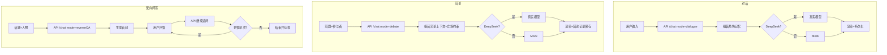

# echoes

  

> 历史人物拟人化对话与多角色辩论的全栈原型。提供从前端交互、后端上下文组装、记忆管理，到模型生成与本地持久化的一整套解决方案。

本项目的目标是：让 AI 在回答时更“像”历史人物本身，而非泛化的助手。通过“人格约束 + 角色记忆 + 辩论上下文”的组合，尽量保证角色的语言风格与立场一致性。

```text
人格约束 + 角色记忆 + 辩论上下文 + 模型生成 + 本地持久化
```

## 快速开始

下面的步骤会把“环境准备 → 安装依赖 → 启动开发服务 → 验证运行”整合为一个可复制的上手流程。

1) 环境与依赖（快速安装）

推荐 Node.js 版本 >= 18（若需 LTS，使用官方 LTS 版）。下面列出常用下载与安装方式：

- Node.js（包含 npm）：[Node.js 官方下载](https://nodejs.org/zh-cn/download/)
- npm 单独安装/升级：[npm 官方安装指南](https://www.npmjs.com/get-npm)
- pnpm（项目使用 pnpm workspaces）：[pnpm 安装说明](https://pnpm.io/installation)

快速安装示例：

```bash
# 检查版本
node -v
pnpm -v

# 如果缺少 pnpm，可用 npm 或 Corepack 安装：
npm install -g pnpm
# 或（Node >= 16.14）使用 corepack
corepack enable
corepack prepare pnpm@latest --activate
```

2) 安装依赖（仓库根目录）

```bash
pnpm install
```


3) 配置环境

请参阅下方 **配置环境** 小节获取 `.env` 的跨平台复制、完整变量列表和示例配置。

4) 启动开发服务（并行启动前后端）

```bash
pnpm dev
```

默认地址：前端 `http://localhost:5173`，后端 `http://localhost:4000`。

5) 快速验证（参见下方 `API 快速体验` 中的 curl/PowerShell/Postman 示例）

提示：如需仅启动单端服务，使用：

```bash
pnpm --filter @echoes/web dev   # 前端
pnpm --filter @echoes/api dev   # 后端
```

> 可选：在 `apps/api/.env` 填写 `DEEPSEEK_API_KEY` 以启用真实模型；未填则使用本地 Mock。

## 目录

- [项目亮点](#项目亮点)
- [这套系统在做什么](#这套系统在做什么)
- [技术栈](#技术栈)
- [项目结构](#项目结构)
- [运行流程](#运行流程)
- [环境要求](#环境要求)
- [安装依赖](#安装依赖)
- [配置环境](#配置环境)
- [本地开发](#本地开发)
- [构建](#构建)
- [部署流程](#部署流程)
- [数据与持久化](#数据与持久化)
- [API 快速体验](#api-快速体验)
- [故障排查](#故障排查)
- [贡献与约束](#贡献与约束)


## 项目亮点

| 维度 | 说明 | 价值 |
| :-- | :-- | :-- |
| 对话 | 单人物问答 + 本地历史 | 可持续追溯 |
| 辩论 | 多角色轮流发言 + 立场约束 | 更像真实讨论 |
| 反向问答 | 历史人物主动向用户提问 | 沉浸式学习体验 |
| 记忆 | 按用户与人物拆分存储 | 避免上下文漂移 |
| 模型 | DeepSeek 优先，本地 Mock 回退 | 便于联调与离线开发 |
| 数据管理 | 独立历史页 + 导出/导入/删除 | 数据可迁移、可备份 |
| 部署 | pnpm + Vite + Express + pm2 + nginx | 从开发到上线能落地 |

## 这套系统在做什么

- 历史人物对话：围绕单一人物展开问答，支持本地历史记录。
- 人物辩论：支持最多 3 位角色围绕同一辩题连续发言，并保存辩论记录。
- 反向问答：让历史人物主动向用户提问，用户回答后继续追问，形成沉浸式对话体验。
- 角色宪法：用规则约束每位人物的知识边界、语言风格与反应方式。
- 记忆管理：按用户和人物维度保存对话，辅助模型保持上下文一致性。
- 数据管理：对话、辩论、反向问答各有独立历史页，支持导出（Markdown / TXT）和导入（JSON / MD / TXT）功能，方便数据迁移与备份。
- 模型接入：优先使用 DeepSeek，未配置时回退到本地模拟器，便于离线开发。

## 技术栈

- 前端：React 18 + TypeScript + Vite
- 后端：Node.js + Express + TypeScript
- 模型接入：DeepSeek Chat API（可选）
- 本地回退：LLM Mock 模拟器
- 数据存储：本地 JSON 文件持久化
- 工程管理：pnpm workspaces
- 部署：pm2 + nginx + 静态站点发布脚本

## 项目结构

```text
.
├── apps/
│   ├── api/        # Express API、记忆管理、模型调用
│   └── web/        # React 前端
├── scripts/
│   └── deploy.sh   # 一键部署脚本
├── .env.example
├── package.json
├── pnpm-workspace.yaml
└── README.md
```

## 运行流程

### 对话模式

1. 用户选择人物并输入问题。
2. 前端将问题、人物和对话上下文发给 API。
3. 后端根据人物宪法和最近对话拼装提示词，调用模型生成回复。
4. 前端渲染回复，并将对话持久化到本地存储。
5. 支持按人物查看、删除历史记录，并可导出为 Markdown / TXT。

### 辩论模式

1. 用户选择辩题和 2–3 位辩论参与者。
2. 每位角色根据立场约束、辩论前文轮流发言。
3. 后端拼接完整辩论上下文，确保角色立场一致性。
4. 辩论记录独立保存，支持导出和回看。

### 反向问答模式

1. 用户选择人物并输入话题/起点。
2. 后端生成第一轮提问，历史人物主动向用户发问。
3. 用户回答后，后端根据对话历史继续追问，形成连续的 QA 链。
4. 支持多轮对话，每次追问基于前文保持话题连贯。
5. 反向问答使用独立的历史页面管理，支持新建会话、加载已有会话、导出和导入。



## 环境要求

本项目的环境准备与依赖安装已整合到上方的 **快速开始 → 环境与依赖（快速安装）** 小节，建议按该小节步骤执行。该处仅作简要说明：

- 建议使用 Node.js LTS（>=18）
- 项目使用 `pnpm` 管理工作区（不强制，但推荐）
- 如果需要真实模型，请在 `apps/api/.env` 中配置 `DEEPSEEK_API_KEY`

## 安装依赖

快速开始中已包含依赖安装步骤（见 **快速开始 → 环境与依赖**）。在此处补充：若因为 lockfile 导致安装失败，可使用：

```bash
pnpm install --no-frozen-lockfile
```

## 配置环境

仓库根目录提供了 `.env.example`，你可以据此创建环境文件（跨平台示例）：

```bash
# macOS / Linux
cp .env.example apps/api/.env

# Windows PowerShell
copy .env.example apps\api\.env
```

或者直接在 `apps/api/.env` 中配置以下变量：

```dotenv
PORT=4000
DEEPSEEK_API_KEY=
DEEPSEEK_API_URL=https://api.deepseek.com/v1
ECHOES_DB_PATH=./echoes.db.json
ECHOES_DB_MAX_ENTRIES=1000
```

前端如果需要显式指定 API 地址，可以设置：

```dotenv
VITE_API_BASE=http://localhost:4000
```

说明：

- `DEEPSEEK_API_KEY`：配置后启用真实模型调用；不配置则使用本地模拟器。
- `DEEPSEEK_API_URL`：可选，自定义 DeepSeek 网关地址。
- `PORT`：API 服务端口，默认 `4000`。
- `ECHOES_DB_PATH`：本地 JSON 数据库存储路径。
- `ECHOES_DB_MAX_ENTRIES`：最大保存条目数，超出后自动裁剪。
- `VITE_API_BASE`：前端请求后端的基础地址。

## 本地开发

### 一键启动前后端

```bash
pnpm dev
```

这个命令会并行启动 `apps/web` 和 `apps/api`。

### 单独启动前端

```bash
pnpm --filter @echoes/web dev
```

前端默认运行在 `http://localhost:5173/`。

### 单独启动后端

```bash
pnpm --filter @echoes/api dev
```

后端默认运行在 `http://localhost:4000/`。

## 构建

### 构建整个仓库

```bash
pnpm build
```

### 仅构建前端

```bash
pnpm --filter @echoes/web build
```

### 仅构建后端

```bash
pnpm --filter @echoes/api build
```

### 后端类型检查

```bash
pnpm --filter @echoes/api typecheck
```

## 预览前端产物

前端构建完成后，可以使用预览服务查看生产构建效果：

```bash
pnpm --filter @echoes/web preview
```

## 部署流程

仓库提供了一个一键部署脚本：`scripts/deploy.sh`。

```bash
sudo ./scripts/deploy.sh main
```

默认流程大致如下：

1. 拉取最新代码并切换到指定分支。
2. 安装依赖。
3. 构建前端并发布到 nginx 静态目录。
4. 检查或创建 `apps/api/.env`。
5. 构建后端并重启 `pm2` 中的 `echoes-api`。
6. 进行基础健康检查并尝试重载 nginx。

如果你不想做站点备份：

```bash
sudo ./scripts/deploy.sh main --no-backup
```

## 数据与持久化

- 对话历史默认保存在仓库根目录下的 JSON 文件中。
- 辩论历史和反向问答会话各自独立存储，互不干扰。
- 所有数据均以用户 ID（`echoes.userId`）为维度拆分，不同用户互不可见。
- 每种模式都有独立的本地存储键：
  - 对话历史：`echoes.history.<uid>`
  - 辩论记录：`echoes.debates.<uid>`
  - 反向问答：`echoes.reverseqa.<uid>`
- 每种模式均提供独立历史页面，支持：
  - **查看**：按会话浏览历史记录。
  - **导出**：支持 Markdown 和纯文本两种格式。
  - **导入**：支持 JSON、Markdown 和 TXT 格式，可恢复之前导出的会话。
  - **删除**：按会话或按人物维度删除。
  - **新会话**：创建全新会话，不会被历史自动回填。
- `ECHOES_DB_MAX_ENTRIES` 可以控制后端历史数据的最大条数，避免文件无限增长。

## API 快速体验

后端提供 `POST /chat` 接口用于快速体验。默认地址为 `http://localhost:4000/chat`（可通过 `VITE_API_BASE` 覆盖）。

快速 `curl` 示例：

```bash
curl -X POST http://localhost:4000/chat \
  -H "Content-Type: application/json" \
  -d '{"role":"孔子","input":"什么是仁？","mode":"dialogue"}'
```

Windows PowerShell 示例（无 curl）：

```powershell
Invoke-RestMethod -Uri http://localhost:4000/chat -Method POST -Body (@{role='孔子';input='什么是仁？';mode='dialogue'} | ConvertTo-Json) -ContentType 'application/json'
```

请求示例（可直接发送的 JSON）：

```json
{
  "role": "孔子",
  "input": "什么是仁？",
  "mode": "dialogue"
}
```

示例返回（示意）：

```json
{
  "reply": "仁，是爱人也。以恭俭为礼，以诚信为本，推己及人。",
  "debateMeta": null
}
```

Postman：

- 新建 `POST` 请求，URL 填 `http://localhost:4000/chat`。
- 在 `Headers` 添加 `Content-Type: application/json`。
- 在 `Body` 选择 `raw` → `JSON`，粘贴上面的请求 JSON。

辩论模式需要在请求体中加入 `debateContext`（由前端构造的辩论轮次数组）或 `mode: "debate"`，服务器会据此拼接更完整的提示词并返回包含 `stance`、`stanceSummary` 的结构化结果。

反向问答模式：

```bash
curl -X POST http://localhost:4000/chat \
  -H "Content-Type: application/json" \
  -d '{"role":"孔子","input":"请围绕「仁」展开话题","mode":"reverseQA"}'
```

```json
{
  "role": "孔子",
  "input": "请围绕「仁」展开话题",
  "mode": "reverseQA"
}
```

示例返回（示意）：

```json
{
  "reply": "敢问足下，何为仁？仁者爱人，此言是否过简？",
  "debateMeta": null
}
```

反向问答支持多轮，前端会将对话历史（不含本轮的之前轮次）一并传入 `history` 字段，后端据此生成与前文连贯的追问。

## 现在有哪些能力

### 对话
- 单人物问答，支持本地历史记录与按角色维度查看。
- 支持自定义人物，自由输入任意角色名。
- 历史记录可按人物查看、删除单条或清空全部。

### 辩论
- 支持 2–3 位角色围绕同一辩题轮流发言。
- 辩论上下文自动拼接，保持角色立场稳定性。
- 辩论记录独立保存，支持回看、导出和删除。

### 反向问答（新增）
- 历史人物主动向用户提问，用户回答后继续追问。
- 首轮由模型根据话题自动生成第一问，后续基于前文生成追问。
- 多轮连续对话，支持中途切换会话。
- 独立的历史页面管理，支持新建、加载、导出、导入、删除。

### 数据管理
- 对话、辩论、反向问答各有独立历史页面，互不混淆。
- **导出**：支持 Markdown 和 TXT 两种格式，方便分享与存档。
- **导入**：支持 JSON、Markdown 和 TXT 格式，可恢复之前导出的会话。
- 按用户 ID 隔离数据，不同用户数据互不可见。

### 模型
- 优先使用 DeepSeek Chat API，未配置密钥时自动回退到本地模拟器。
- 本地 Mock 无需外部依赖，适合离线开发与联调。

## 故障排查

- `pnpm install` 失败：尝试 `pnpm install --no-frozen-lockfile`，或检查 pnpm 版本。
- API 没有走真实模型：确认 `DEEPSEEK_API_KEY` 是否已配置，并检查后端日志。
- 前端连不上后端：检查 `VITE_API_BASE` 是否正确，以及 API 是否运行在 `4000` 端口。
- 辩论内容过于重复：确认后端已启用真实模型或当前 mock 行为是否符合预期。
- 查看 API 日志：

```bash
pm2 logs echoes-api --lines 200
```

- 查看 nginx 错误日志：

```bash
sudo tail -n 200 /var/log/nginx/error.log
```

## 贡献与约束

- 不要把密钥或敏感配置提交到仓库。
- 生产环境建议把 `apps/api/.env` 留在服务器上单独维护。
- 如果你在新增功能，优先保证“人物一致性”和“上下文连续性”这两个核心目标。
